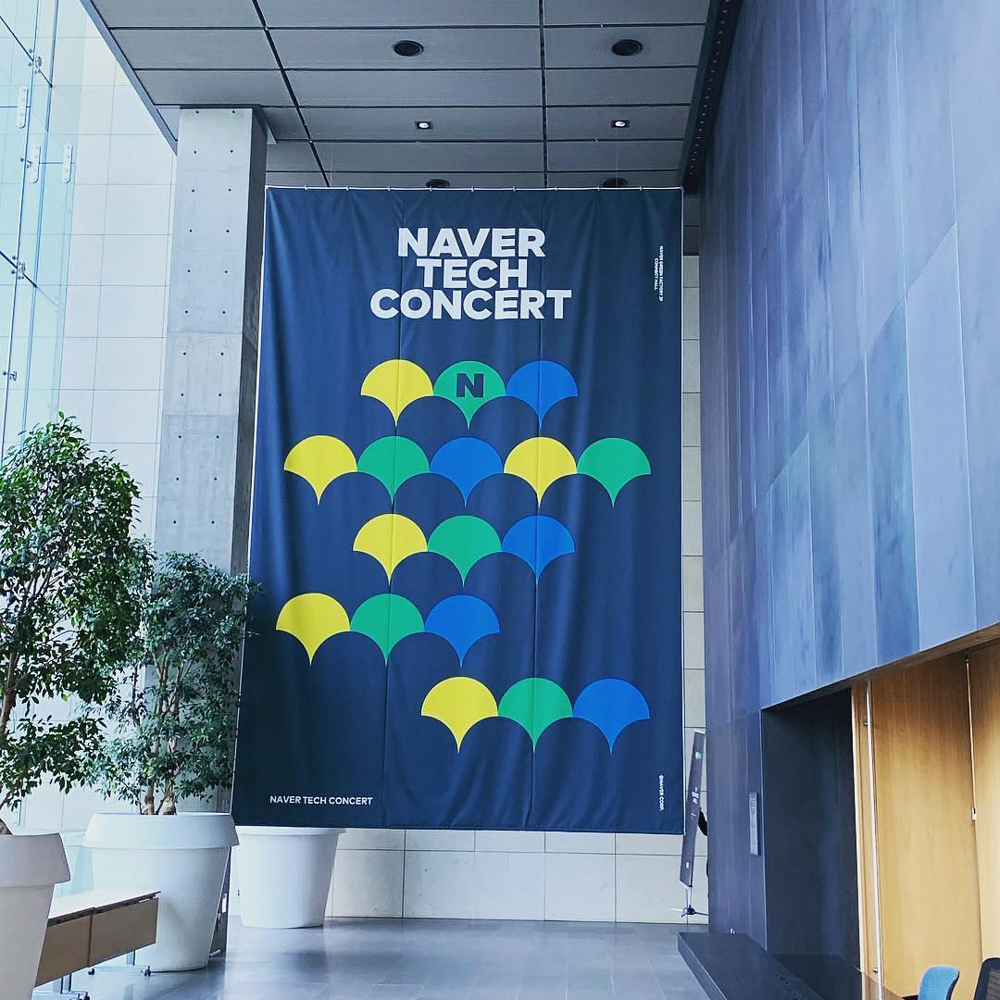

import Callout from '@molecule/Callout';

100년을 인생의 기점으로 내 인생의 1/4를 보냈다. 처음 써보는 회고록으로 나의 2019년 이야기를 담자.

내년 부터는 이게 한해의 큰 이벤트가 될꺼같다 🥳

누구나 쓸 수 있는, 그러나 이 세상에서 유일한 이야기 나의 이야기

작년 2018년에는 참으로 많은 일들이 있었고 그 경험들을 통해서 가지고있던 생각들이 많이 바뀌었던 한 해였다.
어쩌다보니 직장에 취업도 했었고 과감하게 나오기도했고 프리랜서로 일도해봤다. 그중 내가 그렇게 원하던 프리랜서로
반년정도 좋은분 밑에서 일을 받으면서 여러가지 일에 대해서 경험해보고 혼자서 일을 구해서 작업도해보고 어린나이에
경험하기 힘든 경험을 했다고 생각한다. 뭐 사람마다 일적인 환경마다 다를 수 있지만 나 자신이 느끼기에 프리랜서는 
혼자서 모든걸 해나간다는 것을 경험에서 느낄 수 있었고 이 것을 계속 해나가려면 계획도 필요하고 영어도 해야하고 
필요한 능력들이 많다는 것을 알게되었다.

서론이 길었다 그러면 이제 평범한 사원으로 2019년을 보낸 한해를 정리해보자!

그러면 그렇게 직장인으로

<Callout icon="🤔">
  "2019년 나는 어떻게 보냈을까?"
</Callout>

## 일찍 시작하는 아침습관이 생겼다!

회사에 입사하고 3월까지 회사에 적응하기 위해서 시간가는지 모르고 지냈다. 회사업뭄에 대해서 전체적으로 어떻게 돌아가고 있는지?
잘 적응하기 위해서 노력하다 보니 어느세 업무에는 금방 적응 할 수 있었고 그동안 가지고있던 고민들이 하나하나 생각나기 시작했다.

"2시간씩 걸리는 출근길이 너무나 힘들다"  
이 정도 시간이라고하면 다들 엄청 놀라더라 그 동안은 아무 생각이 없었는데 되짚어보니 그 시간동안 유튜브, 페이스북만 보면서
시간을 너무 아깝게 사용하고있었다.

그러다가 외주작업 받았던 일을 다 끝내지 못해서 일찍 출근해서 작업좀해야겠다 생각하고 아침 5시에 
일어나서 출근을 해봤다. 그런데 새벽녘에 출근하니까 2시간 걸리던 출근길이 1시간 30분으로 단축되고 
출근길에 앉아서 갈수있었고 잠도 잠깐자고 그러니까 출근시간이 10분인 것처럼 엄청 짧았다. 그래서 이거다! 
다음날부터 새벽같이 준비해서 출근하게되었다.

처음 시작은 엄청 단순했지만 이 다짐이 꾸준히 가기에는 너무 어렵다는 것을 나는 너무 잘알고있었다. 
꾸준히 반복할 수있는 그런 흥미를 부여하고싶어서 기록을하고 남에게 보여주고 그것에 동기를 얻자! 생각하고 
인스타그램에 하나하나 올리면서 나만에 증거목록을 만들었다. 덕분에 동기를 얻을 수 있었고 습관으로 
자리잡을 수도있었다.

그렇게 처음 100개 게시물을 채웠을때 아직동 생생히 기억한다. 내가 100일동안 아침에 일찍일어났고 
일찍일어나서 공부도하고 생산성있는 아침을 보냈구나

정말 만족스럽고 계속 꾸준히 지켜나가고있는 습관이 생긴것같아 너무 뿌듯하다

`#daily_front_desk`

## 컨퍼런스, 이 좋은것을 이제야 알았을까?

어쩌다가 `NAVER TECH CONCERT`

처음으로 컨퍼런스에 참석했다. 회사에 월차를 내고!TODO 

업무에서 직접적으로 사용하고있는 기술들에 대한 지식, 경험을 공유받을 수 있는게 너무나 만족스러웠습니다. 
하지만 이제 갓 웹에대해 알아가고있는 나는 모르는 내용들이 많아서 모든 경험들을 받아들일 수 없었고 이제야 
'아 그때 왜 이런걸 발표했는지 알겠다'라는 것을 깨달았다.

역시 아는 만큼 보인다고한다. 내년에도 모든 컨퍼런스를 격파하러 다녀야지!

- NAVER TECH CONCERT
- JSConf
- GDG Devfast Seoul
- GDG Webtech

## 스터디, 왜 이제야 시작했을까?

컨퍼런스를 다니면서 더욱더 JavaScript 공부에대한 욕구가 생겼고 배우면서 지금까지 알던 
JS는 정말 빙산의 일각밖에 안됐었구나 느꼇다. 그래서 혼자 공부를 시작했었는데 너무 우물안의 
개구리 같았다. 아마 내가 컨퍼런스에서 경험했던것처럼 공부하는데 있어서도 무언가있을꺼다 생각하고 
처음으로 스터리를 알아보고 경험해봤다.

스터디를하면서 내가 배운 지식을 남에게 공유하고 이해시켜줘야하고 모르는 부분에 대해서 서로 알려주는 
이런 것이 너무 많은 것들을 배우게 해줬습니다. 또 한번 저는 스터디를 해보지 않았을때의 저와 경험해본 저로 
너무나 달라진 모습을 느낄 수 있었다.

스터디를 꼭해보고 운영도해보라고 하는지 너무너무 잘알게되었다.